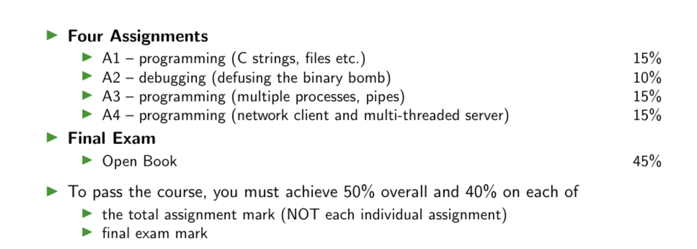
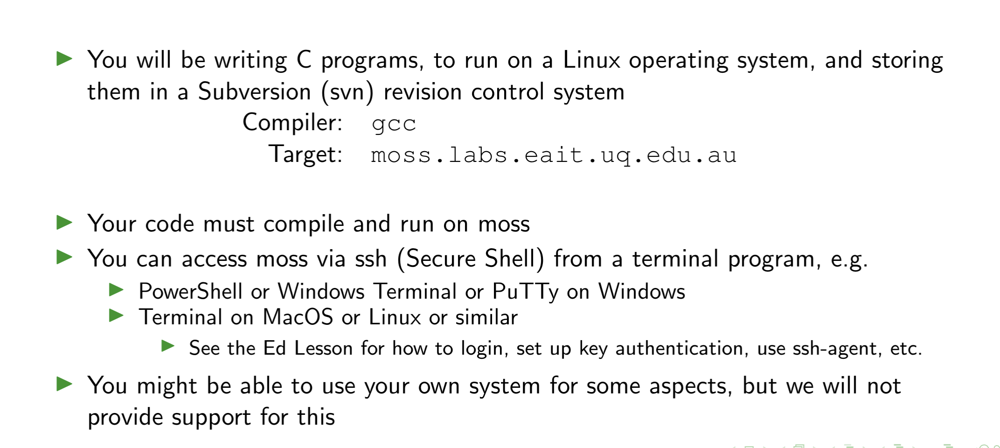

# CSSE2310 
## Lecture 1: Introduction to the course

---
## Assesment
 

#

## Programing Assignments Infrastructure

---
# Terminal Stuff
- 1 

                               Lesson 1 SUMMARY

  1. The cursor is moved using either the arrow keys or the hjkl keys.
         h (left)       j (down)       k (up)       l (right)

  2. To start Vim from the shell prompt type:  vim FILENAME <ENTER>

  3. To exit Vim type:     <ESC>   :q!   <ENTER>  to trash all changes.
             OR type:      <ESC>   :wq   <ENTER>  to save the changes.

  4. To delete the character at the cursor type:  x

  5. To insert or append text type:
         i   type inserted text   <ESC>         insert before the cursor
         A   type appended text   <ESC>         append after the line

NOTE: Pressing <ESC> will place you in Normal mode or will cancel
      an unwanted and partially completed command.

Now continue with Lesson 2.