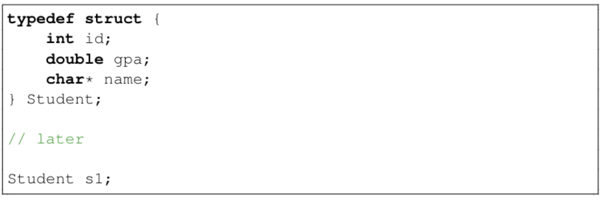

# CSSE2310 Lecture 2
## Intro to Pointers, Memory and Strings
###### 27 / Feb / 2024
---

### Parameters of main()
>Main takes 2 parameters - together, they describe an array of strings:
- int argc: the number of strings in the array
- char** argv or char* argv[]: the array of strings
- argv[0] is the name of the program

> *strlol()* is string to long, it converts a string to a long integer. It is defined in the *stdlib.h* library.

---
### Fun with Pointers

##### Pointers:
-  Allow indirection (which is really important)
-  Are analogoous to python or java references, but much lower level
-  Have a bad reputation, but not black magic
  

### Pointers

##### A Pointer:
- is a value 
- that is the memory address where another thing can be found
- has a type   
  - what sort of thing does the pointer point to
  - *int** and *char** are different types but both are pointers

> **int * var;** (can also write int *var; or int * var;)

declars *var* to be a variable which stores a "pointer to int"

as a short hand, people will often ref to variables by type stored

---

>***point1.c in Week 2***

int * a; // a is a pointer to an int
int value = *a is a way to get the value of what is being pointed to

can do int* a = NULL; to set it to a null pointer which is a pointer that points to nothing, (essentially)

---
#### Getting Valid Pointers

*point2.c*
\

> Note: *%p* is the data type for pointers in C

---

### malloc() and friends

>**free()** is used to free the memory that was allocated by malloc()

>***calloc()** is similar to malloc but it also initialises the memory to 0

>***reallocarray()** is similar to realloc but it also checks for overflow

If initialising to 0 is not important, use malloc() as it is faster than calloc()

---

### void*?

void si used to indicate the lack of something
- void fn... means the function returns nothing
- int fn(void) means the function takes no parameters
void* is a pointer without a type (often called a "generic pointer")
- **DO NOT DEFERENCE VOID***
  - Must cast to a type before dereferencing
  - e.g. malloc() returns a void* so you must cast it to the type you want before dereferencing it
  
---

> point3.c

*MEMORY LEAK*

 > Malloc'd memory is not automatically freed when
>> - It is explicitly released with free()
>> - The program ends
>>> Memory can be free'd in another function, provided the pointer is passed to the function (known)

---
> *point5.c*

##### *This* is what you want. 

###### Since memory was free'd after previous malloc, the second malloc will allocate the same memory space as the first malloc. However, once you call free, you cannot reuse the same pointer. 

*BE CAREFUL: this example also shows how malloc does not always initialise to zero, as the second malloc will not be initialised to zero.*

---

### Dynamic Arrays

The name of an array can be treated as a pointer to the first element of the array

---

### Address-of Operator: &

The address-of operator (&) returns the address of a variable; it generates a pointer

---

### Pointer  <-> Array Equivalence

To find an indexed location in an array, calculate:
> &(arr[index]) -> start of array + index * sizeof(type)

When you add an integer to a pointer, C moves forward in multiples of the size of the type the pointer points to:

e.g.:

---
### NULL Pointer
A null pointer never points to anything valid.

New pointers will be initialised to NULL unless you have a proper value for them'

Standard is using **0**

---

### Structs
> Structs group related variables together
>

- access members using . (dot) operator
- access members using -> (arrow) operator
if using *struct* keyword, you must use -> operator and you need to use brackets to access members

---

### Pointer Related Functions

> void *memset(void *s, int c, size_t n)
> - set a chunk of bytes toa chosen value

>void *memcpy(void *dest, const void *src, size_t n)
> - copy bytes at one pointer to another
> - buffers must not overlap
> use *memmove()* if they do, or might

---

### Where the Variables are

Main places: 
- Global variables + literals etc
- Function local variables (Includes function parameter variables)
  - Allocated on the stack - a downward growing memory area
  - Space allocated when function is called, deallocated when function returns
- Dynamically allocated storage (malloc(), free())
  - Heap
  - Only cleaned up when explicitly freed (while program running)
  - Can store much bigger things than the stack

> ***ulimit -a*** can be used in Moss to check the stack size

---
### Swap

> You cant just swap like *this*

swap1.c

Here is the terminal

> You need to use pointers to swap the values

**swap2.c**

Here is the terminal, success!

---
### Strings
- Strings are stored IN arrays of char
  - Shortened (incorrectly) to "are arrays of char"
- Well-formed strings end in a terminator byte '\0'

Not all arrays of char hold proper strings

> Strings don't store their length, so you have to calculate it every time

>**strlen() is a function that does this for you**
> - finds length by counting chars until it finds a terminator

---

> **join2.c**
>
> 

---
### typedef

typedef is used to create a new type name for an existing type

*typedef actualtype newname;*
eg:

> can also use typedef on structs

---

