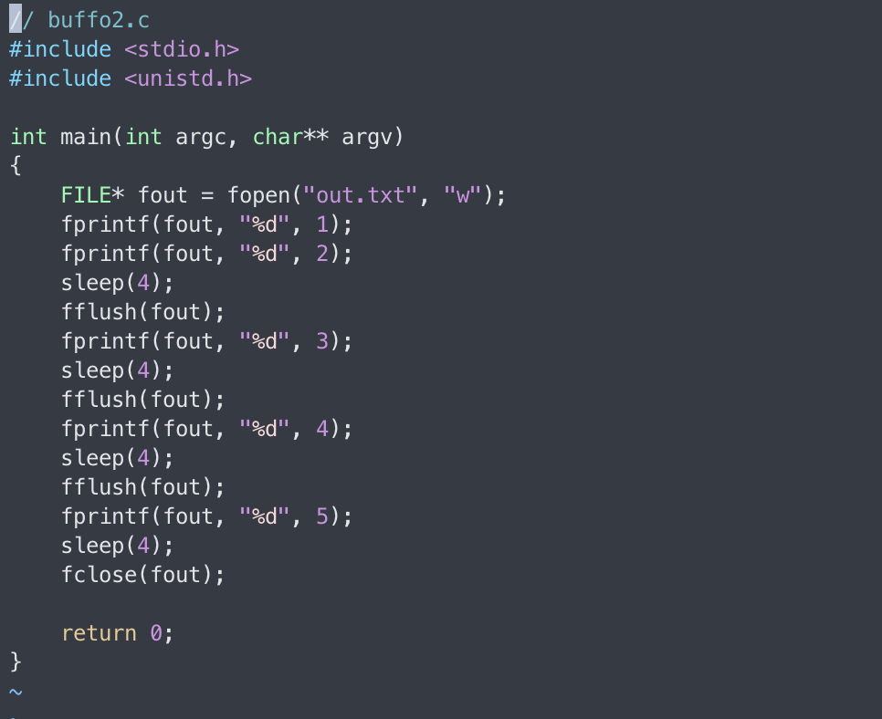
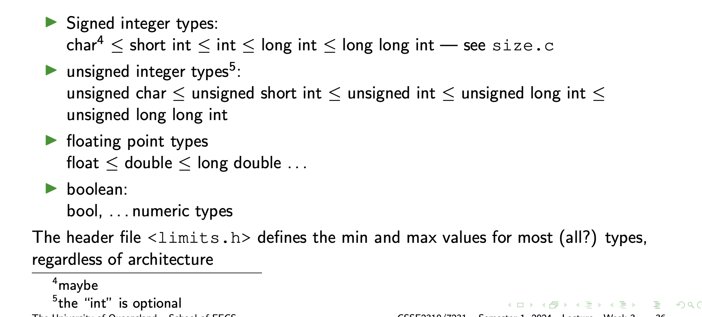

# C Continued, Multi-Dim Arrays, FILEs,
##### Week 3 Lecture | March 5 2024
---
### Details 

> **Functionally no difference between the two**

- One iterates through rows first 

- Other iterates through columns

Most efficient way to go through this would be with the first block of code as the sytsem would expect rows to be iterated first, so caching storage is not required

----
### FILE*

- The type for C standard I/O is FILE*
  - it should be treated as an *opaque* type
- To interact with a file, use ==fopen()== to get a FILE* for it
- ==fclose()== the FILE* when you are finished with it
- stdio.h defines three special FILE* variables that are always available
  - stdin
  - stdout
  - stderr

> copyf.c
> 

> ==fgetc()== returns either a char or the special value EOF
> This is why it needs to be int (to store any possible char AND an extra value)

>copyf is a file that copies the contents of file a to file b
> ./copyf copyf.c a.c
> For fun, try printf("%d\n", EOF)
---
### When is it eof?

> ==feof(f)== is true when the program has tried to read from f and failed because it was at the end

> stdio tests for the edge of a cliff by asking “are we falling?”.

---

 
> ==FILE *fopen(const char *filename, const char *mode)==

**Parameters**
- filename − This is the C string containing the name of the file to be opened.
- mode − This is the C string containing a file access mode. It includes −

---
### Comma Operator for Fun and Profit

---
### Error Checking
> ==fopen()== returns the null pointer if it can't open the file.
> It willset the errno variable to indicate what the problem was

    '''
    {
        FILE* fin = fopen(...);
        if (fin == 0) {
            perror("Opening file:"); // what happened
            return ...
        }
    }
    '''

---
### Output Functions
> fprintf(FILE*, const char* format, ...)

> fputc()

> fputs()

> fwrite()
> binary data (not string)

Consult man pages for parameter order.

---
### input functions
> fgetsc()
> reads one character at a time

> fgets()
> reads one line at a time

> fread()
> binary data

---
### fscanf()

> see scandemo.c
> 
> 

fscanf() is the same as scanf() but with a FILE* as the first parameter

- Need to pass pointers to the variables you want to input into
    
- Need to use a different placeholder for doubles.
- In particular it makes error handling difficult.
  

Consider using sscanf() instead to extract from the string and then check for errors.
    
> Yes there is a ==sscanf()==
> what sscanf() does is return a string containing the input characters that were read in

---
### BufferedO Output
> see buffo.c

> 

> Aside: ’watch’ - a useful shell command

        $ watch -n seconds command

Just because you have printed something doesn’t mean it has actually left the buffer yet

> see buffo2.c
> 
>
> 
### What if I don't close?
- There is a system limit on how many files you can have open at one time. A
long-running program with lots of files open might prevent you from opening any
more.
- If your program exits “normally” ie:
  - return from main() or
  - call exit()
All open FILE*s will be closed

- If your program terminates abnormally, then the file will be closed but no flushing
will occur.

---
### Preprocessor Macros
The preprocessor runs before the main compile and deals with # directives.

        #define PI 3.141

- Every occurance of **PI** will be replaced with 3.141. The compiler will never actually see **PI** it will only see the replacement value

> This can create problems using a debugger because the code you see is not exactly the code that was compiled.

---
### Macros with Parameters
        #define CUBE(X) ((X)*(X)*(X))

- These can look like a function call, but are expanded by the preprocessor.
- Be careful with ()
  - Could we have #define CUBE(X) X*X*X ?
  - Yes. But. . .
  - CUBE(2+3) → 2+3 * 2+3 * 2+3 == 17, not 125
- Beware of side effects:
  - int x=1; int y=CUBE(++x);
  - If it were a function, we would expect the answer to be 8
  - (++x) * (++x) * (++x) = 2*3 * 4 = 24 (and you’ve broken x)

---
### Why use macros with parameters?
Beyond the scope of this course
    - Used carefully macros can reduce repitious and complex code structures, but can be v hard to debug
    - Often used to force inline function code (faster) but modern compilers recognise the inline keyword

---
### enums 
*bool* allows us to have a variable which stores one of a set of named values {true, false}

What about:
- days of the week? {SUNDAY, MONDAY, TUESDAY, WEDNESDAY, THURSDAY, FRIDAY, SATURDAY}
- states in a statemachine? {SETUP, CONNECTED, WORKING, DISCONNECTED, ERROR}

            enum Day {
                SUNDAY,
                MONDAY,
                ...
            };
            enum Day d=TUESDAY;

Behind the scenes, the compiler will choose an int value for each member of the enum

### Fixed Values

        enum Errors {
            E_OK = 0,
            E_TOO_MUCH = 1,
            E_NOT_A_NUMBER = 2
            };

### switch

            enum State s;
            switch (s) {
                case SETUP:
                    printf("Doing setup\n");
                    break;
                case CONNECTED:
                    printf("Doing connected\n");
                    printf(" more connected\n");
                    break;
                default:
                    printf("Doing other states\n");
            };

> see switch.c

Things to watch for:
-  Switch can be used with any integer-like type - doesn’t work with strings or floats.
-  case statements must be constants.
-  Missing break statements!
  
> If you are feeling brave, check out Duff’s Device but please don’t use it in your assignments :)

---
### break
break will jump out of the inner-most, loop or switch statement.

        for (int num=2; num<100; ++num) {
            bool prime=true;
            for (int factor=2; factor<num; ++num) {
                if (num%factor == 0) {
                    prime=false;
                    break;
                }
            }
            if (prime) {
                printf("%d ", num);
            }
        }

### continue 
continue jumps to the next iteration of the inner-most loop.

        while (fgets(buffer, 80, input)) {
            if (strlen(buffer)<5) {
                continue; // read the next line
            }
        // more processing
        }

---
### Types

---
### <limits.h> excerpt

        /* Number of bits in a `char'. */
        # define CHAR_BIT 8
        /* Minimum and maximum values a `signed char' can hold. */
        # define SCHAR_MIN (-128)
        # define SCHAR_MAX 127
        /* Maximum value an `unsigned char' can hold. (Minimum is 0.) */
        # define UCHAR_MAX 255
        /* Minimum and maximum values a `signed short int' can hold. */
        # define SHRT_MIN (-32768)
        # define SHRT_MAX 32767
        ...

---
### Function Pointers
#### Why?
Sometimes we want to put functions into variables:

- Callbacks : when a particular thing happens call this function
  - GUIs and other event driven tasks
- Flexible functionality
  - Change how one part of an overall task is done
  - Eg: sorting how is ordering defined? (see man 3 qsort)
  
In C the name of a function (without () is treated as a function-pointer for it).
- Similarly to the name of an array being a pointer to the first element
- See fp1.c for a possible warning message (with -Wall)
> 

### syntax 

